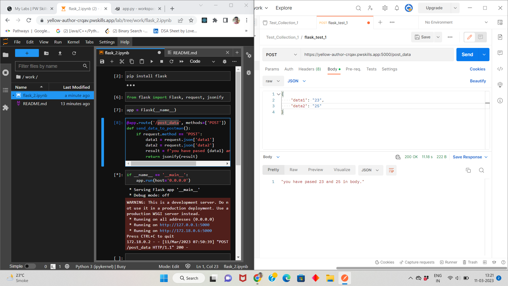

<!--  -->
# Q1. Explain GET and POST methods.
GET and POST are HTTP methods used to request and send data between a client (such as a web browser) and a server. Both methods are commonly used in web applications, but they have different purposes and characteristics.

GET method:
- GET is used to request data from a specified resource.
- It is a safe and idempotent method, meaning that it does not modify any data on the server and can be repeated multiple times without changing the server's state.
- GET requests are typically used to retrieve information from the server, such as a web page or a resource's metadata.
- GET requests can be easily cached by the browser, which can improve performance.

POST method:
- POST is used to submit data to be processed to a specified resource.
- It is not a safe or idempotent method, meaning that it can modify data on the server and should not be repeated multiple times without careful consideration.
- POST requests are typically used to send data to the server, such as submitting a form or uploading a file.
- POST requests are not easily cached by the browser, which can make them slower than GET requests.

In summary, GET is used to retrieve data, while POST is used to submit data. GET is safe and idempotent, while POST is not. GET requests can be cached, while POST requests cannot.

# Q2. Why is request used in Flask?
- In Flask, the request object is used to access incoming request data. When a client sends a request to the server, the server receives the request data and creates a request object that contains information about the request, such as the HTTP method used, any request parameters, and the request headers.

- The request object in Flask provides a simple way to access this information and process it in the application. For example, if a user submits a form on a web page, the form data will be included in the request, and the Flask application can use the request object to access and process this data.

- The request object in Flask is also used to handle HTTP methods like GET and POST. For example, if a GET request is made, the request object can be used to extract any parameters passed in the query string, while if a POST request is made, the request object can be used to extract any form data that was submitted.

Overall, the request object is an important part of Flask's functionality, as it provides a convenient way to access and process incoming request data, and to handle different types of HTTP methods.

# Q3. Why is redirect() used in Flask?
In Flask, the redirect() function is used to redirect a user to a different URL. This function is useful in scenarios where the user needs to be redirected to a different page or resource after performing a certain action, such as submitting a form or logging in.

Here are some reasons why the redirect() function is used in Flask:

- Handling post-request redirect pattern: In web applications, it is often desirable to redirect the user after a POST request, to avoid the user resubmitting the form data if they refresh the page. The redirect() function can be used to redirect the user to a different page or URL after the POST request has been processed.

- Handling errors and exceptions: If an error or exception occurs while processing a request, the redirect() function can be used to redirect the user to an error page or a page that provides more information about the error.

- Handling authentication: In applications that require user authentication, the redirect() function can be used to redirect the user to the login page if they are not authenticated, or to redirect them to the page they were trying to access after they have successfully logged in.

The redirect() function in Flask provides a simple and effective way to redirect users to different pages or resources, and to handle common scenarios such as post-request redirects, error handling, and authentication

# Q4. What are templates in Flask? Why is the render_template() function used?
In Flask, templates are used to generate dynamic HTML pages that can be customized with data from the application. Templates provide a way to separate the presentation logic from the application logic, making it easier to maintain and update the code.

Templates in Flask are typically written in HTML and can include placeholders for dynamic content. For example, a template might include a placeholder for the title of a page, which can be populated with data from the application at runtime.

The render_template() function in Flask is used to render templates and generate HTML pages. This function takes the name of a template file and any data that needs to be passed to the template. The function then generates an HTML page by replacing the placeholders in the template with the actual data.

Here are some reasons why the render_template() function is used in Flask:
- Separation of concerns: The render_template() function allows developers to separate the presentation logic from the application logic, making it easier to maintain and update the code.

- Reusability: Templates can be reused across different pages in the application, reducing the amount of code duplication.

- Dynamic content: Templates allow developers to include dynamic content in HTML pages, making it possible to create pages that are customized to the user's needs.

- Integration with front-end frameworks: Templates can be used in conjunction with front-end frameworks like Bootstrap and Foundation to create responsive and visually appealing pages.

The render_template() function is an essential part of Flask's functionality, as it provides a way to generate dynamic HTML pages and separate the presentation logic from the application logic.

# Q5. Create a simple API. Use Postman to test it. Attach the screenshot of the output in the Jupyter Notebook.

